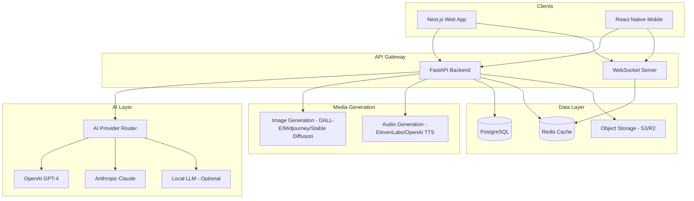
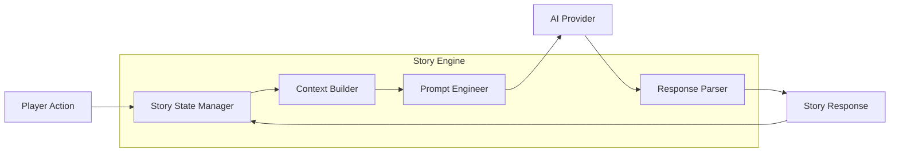
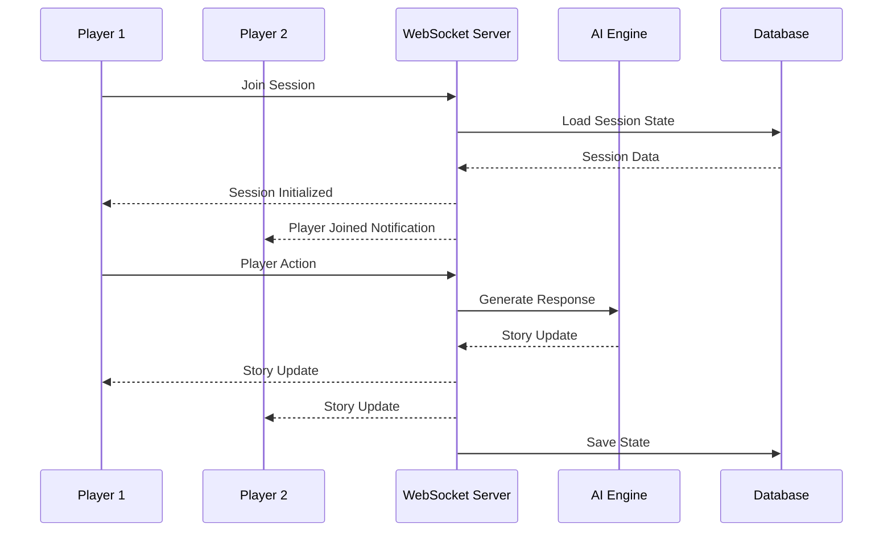
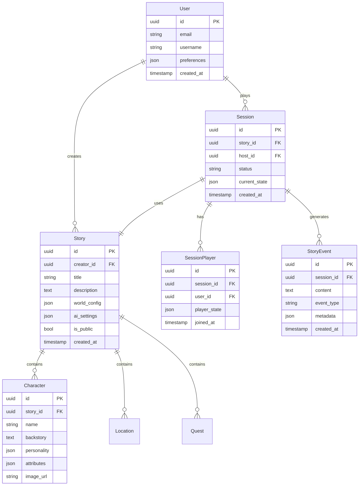
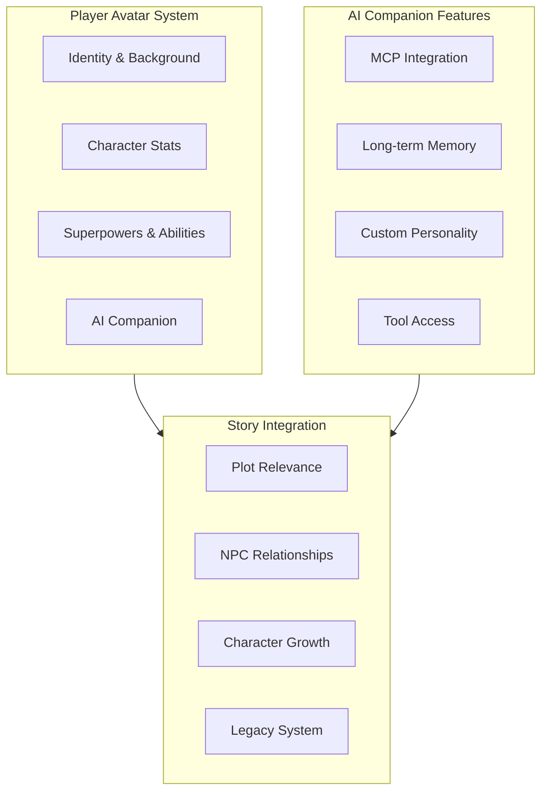
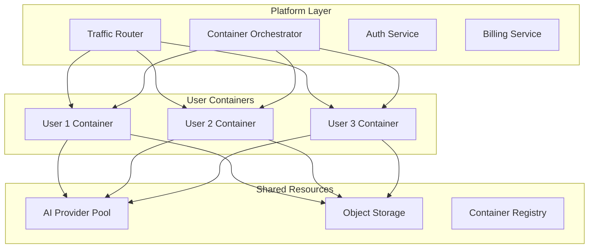
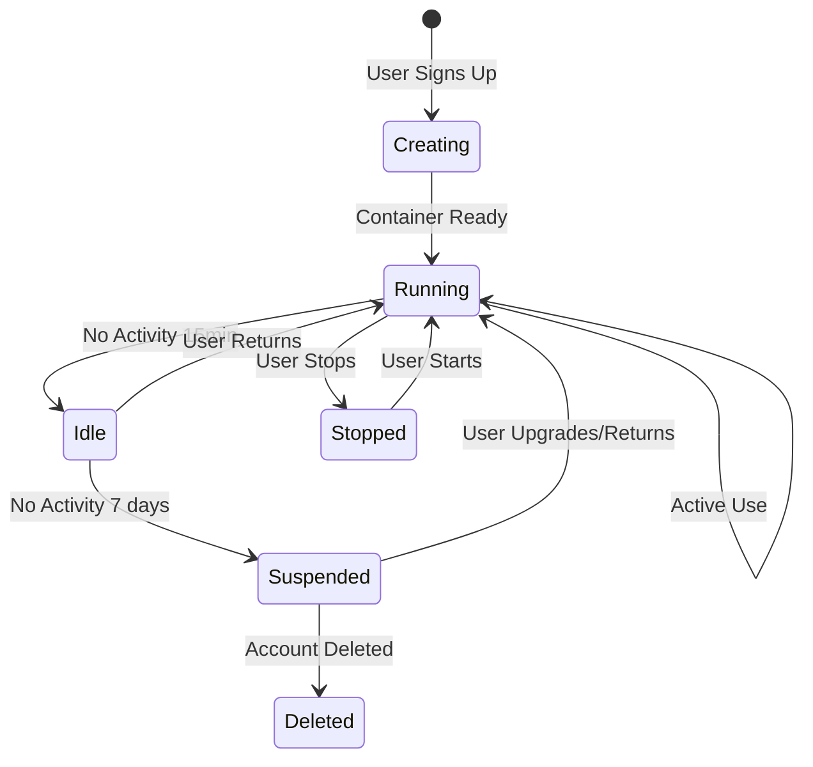
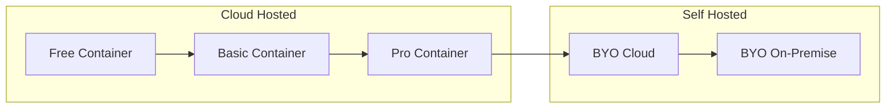
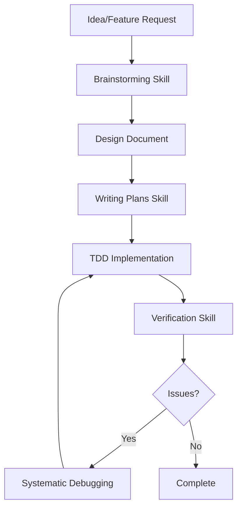

# AI RPG Platform Architecture Plan

## Project Overview

**Name:** Story AI Studio (placeholder)  
**Goal:** Create a platform where creators build interactive story worlds and players experience them through AI-powered roleplaying

### Core Features
- **Story Creator Studio:** Tools for authors to create worlds, characters, quests, and storylines
- **AI Game Master:** Dynamic storytelling engine powered by multiple LLM providers
- **Multiplayer Support:** Real-time collaborative storytelling sessions
- **Media Generation:** AI-generated images and audio for immersion
- **Cross-Platform:** Web app + Mobile app

---

## Recommended Tech Stack

### Backend: Python FastAPI
**Why Python?**
- Best AI/ML ecosystem (LangChain, LlamaIndex, transformers)
- Native OpenAI, Anthropic, and other AI SDK support
- Excellent async support for real-time features
- Easy integration with image/audio generation models

### Frontend: Next.js 14+ (React) + Tauri
**Why Next.js?**
- Server-side rendering for SEO and performance
- App Router with React Server Components
- Excellent TypeScript support
- Rich ecosystem for fantasy UI components
- Large community and resources

**Why Tauri for Desktop?**
- Single codebase for web + Windows app
- Much lighter than Electron (~10MB vs ~150MB)
- Native performance with Rust backend
- Can extend to mobile (iOS/Android) in future
- Secure by design

**Future Mobile Path:**
- Tauri Mobile (same codebase, native mobile apps)
- Or React Native when needed (separate codebase)

### Real-time: FastAPI WebSockets + Redis
**Why this combination?**
- Native WebSocket support in FastAPI
- Redis Pub/Sub for scaling across multiple server instances
- Low latency for multiplayer interactions

---

## System Architecture



---

## Core Components

### 1. Story Engine

The heart of the platform - manages story state, player choices, and AI interactions.



**Key Features:**
- Maintains story context and history
- Builds optimized prompts for LLMs
- Parses structured AI responses
- Handles branching narratives

### 2. AI Provider Abstraction Layer

```typescript
// Conceptual interface
interface AIProvider {
  generateStory(context: StoryContext): Promise<StoryResponse>;
  generateDialogue(character: Character, situation: string): Promise<string>;
  generateImage(description: string): Promise<ImageResult>;
  generateAudio(text: string, voice: string): Promise<AudioResult>;
}

// Supported providers
type ProviderType = 'openai' | 'anthropic' | 'local';
```

**Features:**
- Automatic failover between providers
- Cost optimization (route to cheapest capable model)
- Rate limiting and quota management
- Response caching for repeated queries

### 3. Real-time Multiplayer



**Features:**
- Turn-based or free-form modes
- Synchronized story state
- Player presence indicators
- Action queue for fair play

### 4. World Builder Studio

Tools for creators to design their story worlds:

- **World Editor:** Define settings, locations, lore
- **Character Creator:** Design NPCs with personalities, backstories
- **Quest Designer:** Create storylines and branching paths
- **Rule System:** Define game mechanics (combat, skills, etc.)
- **Asset Manager:** Upload or generate images/audio

---

## Database Schema (Core Models)



---

## API Structure

### REST API Endpoints

```
Authentication
├── POST /auth/register
├── POST /auth/login
├── POST /auth/refresh
└── POST /auth/logout

Stories (Creator Studio)
├── GET    /stories
├── POST   /stories
├── GET    /stories/:id
├── PUT    /stories/:id
├── DELETE /stories/:id
├── GET    /stories/:id/characters
├── POST   /stories/:id/characters
├── GET    /stories/:id/locations
└── POST   /stories/:id/locations

Sessions (Gameplay)
├── POST   /sessions (create new game)
├── GET    /sessions/:id
├── POST   /sessions/:id/join
├── POST   /sessions/:id/leave
└── GET    /sessions/:id/history

Media Generation
├── POST /generate/image
├── POST /generate/audio
└── GET  /media/:id
```

### WebSocket Events

```
Client → Server
├── session:join
├── session:leave
├── game:action (player input)
├── game:choice (select option)
└── presence:update

Server → Client
├── session:state (full state sync)
├── story:chunk (streaming AI response)
├── story:complete
├── player:joined
├── player:left
└── error
```

---

## AI Integration Details

### Prompt Engineering Strategy

```
System Prompt Structure:
┌─────────────────────────────────────┐
│ World Context                       │
│ - Setting description               │
│ - Current location details          │
│ - Active quests                     │
├─────────────────────────────────────┤
│ Character Context                   │
│ - Player character stats            │
│ - Active NPCs in scene              │
│ - Relationship states               │
├─────────────────────────────────────┤
│ Story Context                       │
│ - Recent events summary             │
│ - Current situation                 │
│ - Available choices                 │
├─────────────────────────────────────┤
│ Response Guidelines                 │
│ - Format requirements               │
│ - Tone and style                    │
│ - Content boundaries                │
└─────────────────────────────────────┘
```

### Response Format (Structured)

```json
{
  "narrative": "The ancient door creaks open...",
  "dialogue": [
    {"speaker": "NPC_Name", "text": "Welcome, traveler..."}
  ],
  "choices": [
    {"id": "a1", "text": "Enter cautiously"},
    {"id": "a2", "text": "Draw your weapon"}
  ],
  "state_changes": {
    "location": "dungeon_entrance",
    "discovered": ["ancient_door"],
    "mood": "tense"
  },
  "media_hints": {
    "image_prompt": "Dark stone corridor with ancient door",
    "ambient_audio": "dungeon_ambience"
  }
}
```

---

## MVP Feature Scope

### Phase 1: Core Experience (MVP)
- [ ] User authentication
- [ ] Story creation (basic world + characters)
- [ ] Single-player AI game master
- [ ] Text-only gameplay
- [ ] OpenAI integration only
- [ ] Basic story state persistence
- [ ] **FoundryVTT content import** (actors, scenes, journals)
- [ ] **D&D SRD 5.1/5.2 content** (monsters, spells, items)

### Phase 2: Enhanced Creation
- [ ] Advanced world builder tools
- [ ] Character personality system
- [ ] Quest/branching story designer
- [ ] Image generation integration
- [ ] Story templates
- [ ] **FoundryVTT world import** (full world data)
- [ ] **Multi-system support** (Pathfinder, Call of Cthulhu)

### Phase 3: Multiplayer
- [ ] Real-time multiplayer sessions
- [ ] Turn-based mode
- [ ] Player presence and chat
- [ ] Session management
- [ ] **FoundryVTT module** (AI Game Master for Foundry users)

### Phase 4: Media & Polish
- [ ] Audio generation (TTS for dialogue)
- [ ] Background music/ambience
- [ ] **Windows Desktop App** (Tauri wrapper)
- [ ] Multi-provider AI support
- [ ] Community features (sharing, ratings)
- [ ] **Standalone VTT** (AI-native virtual tabletop)

### Phase 5: Advanced Features
- [ ] **Time Travel Engine** (branch/rewind story history)
- [ ] **World/Campaign Forking** (clone and modify)
- [ ] **Image Creation Studio** (AI-powered asset creation)
- [ ] **Lore Management System** (advanced wiki/encyclopedia)
- [ ] **Map Builder** (procedural + hand-crafted)
- [ ] **Mobile Apps** (Tauri Mobile or native when needed)

---

## Project Structure

```
story-ai-studio/
├── apps/
│   ├── web/                    # Next.js web app
│   │   ├── app/
│   │   ├── components/
│   │   ├── lib/
│   │   └── public/
│   │
│   └── desktop/                # Tauri desktop app (Phase 4)
│       ├── src-tauri/          # Rust backend
│       └── src/                # Shared with web
│
├── packages/
│   ├── shared/                 # Shared types and utilities
│   │   ├── types/
│   │   ├── constants/
│   │   └── utils/
│   │
│   └── ai-engine/              # AI integration layer
│       ├── providers/
│       ├── prompts/
│       └── parsers/
│
├── services/
│   └── api/                    # FastAPI backend
│       ├── app/
│       │   ├── api/
│       │   ├── models/
│       │   ├── services/
│       │   └── core/
│       ├── tests/
│       └── alembic/            # Database migrations
│
├── infrastructure/
│   ├── docker/
│   ├── kubernetes/
│   └── terraform/
│
└── docs/
    ├── api/
    ├── architecture/
    └── guides/
```

---

## Player Avatar System (Phase 5+)

### Overview

A unique feature where **YOU become part of the story** - not just as a player, but as a fully-realized character with background, stats, superpowers, and an AI assistant companion.

### Core Components



### Player Character Features

#### 1. Identity & Background
- **Personal Backstory:** AI-generated or custom-written history
- **Origin Story:** Where you came from, defining moments
- **Motivations:** Goals, fears, desires that drive decisions
- **Relationships:** Family, friends, enemies from your past
- **Visual Identity:** AI-generated portrait, customizable appearance

#### 2. Character Stats System
- **Core Attributes:** Strength, Dexterity, Intelligence, Wisdom, Charisma, Constitution
- **Skills:** Trained abilities that grow with use
- **Specializations:** Unique skill trees based on playstyle
- **Progression:** XP-based leveling with meaningful choices
- **Dynamic Stats:** Stats that change based on story events

#### 3. Superpowers & Abilities
- **Power Categories:**
  - Physical (super strength, speed, durability)
  - Mental (telepathy, precognition, mind control)
  - Elemental (fire, ice, lightning, earth)
  - Reality (time manipulation, dimension shifting)
  - Cosmic (reality warping, creation)
- **Power Progression:** Unlock and upgrade powers through story
- **Power Combinations:** Combine abilities for unique effects
- **Limitations & Costs:** Powers have consequences and limits

#### 4. AI Companion (MCP-Powered)

**What is MCP?**
Model Context Protocol (MCP) allows the AI companion to:
- Access external tools and APIs
- Remember everything across sessions
- Execute actions on your behalf
- Connect to databases, files, and services

**AI Companion Features:**
| Feature | Description |
|---------|-------------|
| **Persistent Memory** | Remembers all conversations, decisions, relationships |
| **Tool Access** | Can search web, access files, call APIs |
| **Personality** | Customizable companion personality |
| **Advisory Role** | Suggests actions, warns of dangers |
| **Story Awareness** | Knows plot threads, secrets, lore |
| **Proactive Actions** | Can initiate conversations, suggest quests |

**MCP Integration Example:**
```typescript
// AI Companion with MCP tools
const companion = {
  name: "Aria",
  personality: "wise mentor with dry humor",
  mcpTools: [
    "memory_search",      // Search past events
    "lore_lookup",        // Access world encyclopedia
    "relationship_map",   // Track NPC relationships
    "quest_tracker",      // Monitor active quests
    "power_analyzer",     // Analyze power combinations
    "story_predictor",    // Predict story branches
  ],
  capabilities: [
    "Remembers your choices across all campaigns",
    "Can look up any lore or rule instantly",
    "Tracks relationship changes with NPCs",
    "Suggests optimal power combinations",
    "Warns about potential story consequences"
  ]
};
```

### Story Integration

#### Plot Relevance
- **Main Character Status:** You are central to the story, not a side character
- **Prophetic Elements:** Story acknowledges your importance
- **Unique Storylines:** Content only accessible to your character
- **World Impact:** Your decisions shape the world permanently

#### Relationship System
- **Dynamic NPCs:** Characters remember and react to you
- **Romance Options:** Deep relationship storylines
- **Rivalries:** Enemies that persist across sessions
- **Mentorships:** NPCs that teach and guide you

#### Character Growth
- **Meaningful Choices:** Decisions that matter long-term
- **Skill Evolution:** Abilities that grow with use
- **Power Unlocks:** New abilities from story events
- **Personality Development:** Your character evolves based on choices

#### Legacy System
- **Cross-World Reputation:** Your legend spreads to new campaigns
- **Heirlooms:** Items that carry over between stories
- **Followers:** NPCs that join you in new adventures
- **Legend Points:** Currency earned from past achievements

### Technical Implementation

```typescript
interface PlayerAvatar {
  id: string;
  userId: string;
  
  // Identity
  name: string;
  title: string;
  backstory: Backstory;
  portrait: ImageReference;
  
  // Stats
  attributes: Attributes;
  skills: SkillMap;
  level: number;
  experience: number;
  
  // Powers
  powers: Power[];
  powerPoints: number;
  powerCombinations: PowerCombo[];
  
  // AI Companion
  companion: AICompanion;
  
  // Story State
  reputation: ReputationMap;
  relationships: RelationshipMap;
  achievements: Achievement[];
  legacy: LegacyData;
}

interface AICompanion {
  name: string;
  personality: PersonalityProfile;
  memory: LongTermMemory;      // MCP-powered
  tools: MCPTool[];            // Available MCP tools
  relationship: CompanionBond; // Bond with player
  knowledge: KnowledgeBase;    // Story awareness
}
```

### Monetization Integration

| Feature | Free | Explorer | Creator | Master |
|---------|------|----------|---------|--------|
| Basic Avatar | ✓ | ✓ | ✓ | ✓ |
| Custom Backstory | Basic | Advanced | Full | Full |
| Power Slots | 3 | 5 | 10 | Unlimited |
| AI Companion | Basic | Standard | Advanced | MCP Full |
| MCP Tools | None | 3 | 10 | Unlimited |
| Legacy System | ✗ | Basic | Full | Full + Cross-world |

---

## Key Technical Decisions

### Why This Stack?

| Requirement | Solution | Rationale |
|-------------|----------|-----------|
| AI Integration | Python FastAPI | Best AI/ML ecosystem, native async |
| Web Performance | Next.js | SSR, SEO, React ecosystem |
| Desktop App | Tauri | Single codebase, lightweight (~10MB) |
| Future Mobile | Tauri Mobile | Same codebase, native apps |
| Real-time | WebSockets + Redis | Scalable, low latency |
| Database | PostgreSQL | JSON support, reliability |
| Caching | Redis | Session state, rate limiting |
| Storage | S3/R2 | Media assets, scalable |

### Frontend: Next.js + Tauri

| Option | Pros | Cons | Decision |
|--------|------|------|----------|
| **Next.js + Tauri** | Web + Desktop + Future Mobile, lightweight | Requires Rust for advanced features | ✅ **Recommended** |
| Electron | Mature, JavaScript-only | Heavy (~150MB), memory intensive | Rejected |
| React Native | Mobile-first | Separate codebase, weaker desktop | Rejected |
| Flutter | Cross-platform | Dart ecosystem, not web-native | Rejected |

**Why Tauri:**
- 10-50x smaller than Electron
- Native performance with Rust backend
- Same codebase for web + desktop + future mobile
- Secure by design (no Node.js in bundle)

### Backend: FastAPI vs Django vs Node

| Option | Pros | Cons | Decision |
|--------|------|------|----------|
| **FastAPI** | Best AI ecosystem, async-native, modern | Smaller community than Django | ✅ **Recommended** |
| Django | Mature, admin panel, ORM | Sync by default, heavier | Alternative |
| Node.js | Unified TypeScript | Weaker AI ecosystem | Rejected |

**Why FastAPI over Django:**
- Native async/await for real-time features
- Better performance for AI workloads
- Modern type hints and validation
- Easier integration with AI libraries

### Alternative Considerations

| Option | Pros | Cons | Decision |
|--------|------|------|----------|
| Node.js Backend | Unified TypeScript | Weaker AI ecosystem | Rejected |
| Go Backend | Performance | Complex AI integration | Rejected |
| GraphQL API | Flexible queries | Overkill for MVP | Future consideration |
| MongoDB | Flexible schema | Less structured | Rejected |

---

## Next Steps

1. **Set up monorepo structure** with pnpm workspaces
2. **Initialize FastAPI backend** with basic auth and story models
3. **Create Next.js web app** with authentication UI
4. **Implement AI provider abstraction** with OpenAI first
5. **Build story creation flow** (world → characters → publish)
6. **Develop gameplay engine** (session management, AI responses)
7. **Add streaming responses** for better UX
8. **Implement state persistence** and session recovery

---

## Monetization Model: Hybrid Subscription + Credits

> **See [monetization-model.md](monetization-model.md) for full details**

### Pricing Tiers Overview

| Tier | Price | Turns | Multiplayer | Key Features |
|------|-------|-------|-------------|--------------|
| Free | $0 | 25/day | 1 player | Basic AI, 3 worlds |
| Explorer | $9.99/mo | Unlimited | 3 players | Standard AI, 5 worlds |
| Creator | $19.99/mo | Unlimited | 5 players | Advanced AI, images, TTS |
| Master | $29.99/mo | Unlimited | 6 players | Premium AI, voice cloning |

### Credit System

Credits are used for premium features across all tiers:

| Action | Credits | Notes |
|--------|---------|-------|
| Premium AI Turn | 2 | GPT-4 quality |
| Image Generation | 10-20 | Standard to HD |
| Voice Synthesis | 5-15 | Short to long |
| Voice Cloning | 50 | Custom character voices |

### Credit Packs

| Pack | Credits | Price |
|------|---------|-------|
| Starter | 500 | $4.99 |
| Value | 1,500 | $12.99 |
| Pro | 5,000 | $39.99 |
| Ultimate | 10,000 | $69.99 |

### Regional Pricing

Purchasing power parity pricing for emerging markets:
- LATAM: ~50% discount
- MENA: ~60% discount
- South Asia: ~70% discount

---

## Self-Hosting Architecture (Docker Per User)

### Overview

A unique hosting model where each user gets their own isolated Docker container, giving them full control over their instance while the platform manages infrastructure. Users can invite others to their private server.

### Architecture Diagram



### Container Architecture

#### User Container Contents

Each user container includes:

```yaml
# user-container/docker-compose.yml
services:
  app:
    image: story-ai-studio:latest
    environment:
      - USER_ID=${USER_ID}
      - AI_PROVIDER=${AI_PROVIDER}
      - DATABASE_URL=postgresql://db:5432/user_db
    volumes:
      - user_data:/app/data
      - user_media:/app/media
    ports:
      - "3000:3000"
  
  db:
    image: postgres:16-alpine
    environment:
      - POSTGRES_DB=user_db
    volumes:
      - postgres_data:/var/lib/postgresql/data
  
  redis:
    image: redis:7-alpine
    volumes:
      - redis_data:/data
  
  ai-proxy:
    image: ai-proxy:latest
    environment:
      - OPENAI_API_KEY=${OPENAI_API_KEY}
      - ANTHROPIC_API_KEY=${ANTHROPIC_API_KEY}
```

### Hosting Tiers

| Tier | Container Resources | Storage | AI Calls | Price |
|------|---------------------|---------|----------|-------|
| **Self-Hosted Free** | 0.5 CPU, 512MB RAM | 1GB | 25/day | $0 |
| **Self-Hosted Basic** | 1 CPU, 1GB RAM | 5GB | 100/day | $9.99/mo |
| **Self-Hosted Pro** | 2 CPU, 2GB RAM | 20GB | Unlimited | $19.99/mo |
| **Self-Hosted Enterprise** | 4 CPU, 4GB RAM | 50GB | Unlimited | $39.99/mo |
| **BYO Server** | Unlimited | Unlimited | Your API keys | $4.99/mo platform fee |

### User Control Features

#### What Users Can Do In Their Container

1. **Full Configuration Control**
   - Choose AI providers and models
   - Set custom rate limits
   - Configure moderation rules
   - Install custom plugins/modules

2. **Data Ownership**
   - Full database access
   - Export/import data anytime
   - Backup scheduling
   - Data retention policies

3. **Invite System**
   - Invite friends to private server
   - Set permissions per user
   - Create private campaigns
   - Control who joins games

4. **Customization**
   - Custom themes and branding
   - Custom AI prompts
   - House rules and modifications
   - Custom content packs

### Technical Implementation

#### Container Orchestration

```typescript
interface UserContainer {
  id: string;
  userId: string;
  status: 'running' | 'stopped' | 'suspended';
  resources: ContainerResources;
  config: UserConfig;
  invitedUsers: InvitedUser[];
  createdAt: Date;
  lastActive: Date;
}

interface ContainerResources {
  cpuCores: number;
  memoryMB: number;
  storageGB: number;
  bandwidthLimit?: number;
}

interface UserConfig {
  aiProvider: 'openai' | 'anthropic' | 'local' | 'custom';
  aiModel: string;
  customPrompts: Record<string, string>;
  moderationLevel: 'none' | 'basic' | 'strict';
  plugins: string[];
}
```

#### Container Lifecycle



### Invite System

#### How Invites Work

1. **Container Owner** sends invite link
2. **Invited User** creates account or logs in
3. **Container Owner** approves access
4. **Invited User** joins private server

```typescript
interface ContainerInvite {
  id: string;
  containerId: string;
  invitedBy: string;
  inviteCode: string;
  permissions: InvitePermission[];
  expiresAt: Date;
  maxUses: number;
  currentUses: number;
}

interface InvitePermission {
  canCreateStories: boolean;
  canPlayGames: boolean;
  canInviteOthers: boolean;
  canModifySettings: boolean;
  maxSessionsPerDay: number;
}
```

### Security & Isolation

#### Container Security

| Layer | Protection |
|-------|------------|
| **Network** | Each container on isolated network |
| **Database** | Separate PostgreSQL instance per container |
| **Storage** | Encrypted volumes per user |
| **API Keys** | Stored in container secrets, not shared |
| **Rate Limiting** | Per-container limits enforced |
| **Backup** | Daily automated backups |

#### Data Isolation

- No shared database between users
- No shared Redis cache
- Separate AI API keys per container (optional)
- Complete data export on request
- GDPR/CCPA compliant deletion

### BYO Server Option

For users who want complete control:

```yaml
# User's own server
docker run -d \
  --name story-ai-studio \
  -p 3000:3000 \
  -e DATABASE_URL=postgresql://... \
  -e OPENAI_API_KEY=sk-... \
  -e PLATFORM_LICENSE=xxx \
  story-ai-studio/self-hosted:latest
```

**Benefits:**
- Full control over hardware
- Use your own AI API keys
- No resource limits
- Complete data sovereignty
- Air-gapped operation possible

### Migration Path



### Monetization for Self-Hosting

| Revenue Source | Description |
|----------------|-------------|
| **Platform Fee** | Monthly fee for container hosting |
| **Resource Upgrades** | CPU/RAM/Storage add-ons |
| **AI Credits** | For users without own API keys |
| **Premium Features** | Advanced plugins, themes |
| **Support Tiers** | Community, Priority, Enterprise |

---

## Development Methodology (Skills Integration)

### Overview

This project uses a rigorous development methodology based on the skills defined in `.kilocode/skills/`. All contributors must follow these practices.

### Core Skills Applied

#### 1. Test-Driven Development (TDD)

**Iron Law:** NO PRODUCTION CODE WITHOUT A FAILING TEST FIRST

```
Red → Green → Refactor → Repeat
```

**Process:**
1. Write one minimal failing test
2. Run test, verify it fails for the right reason
3. Write minimal code to pass
4. Run test, verify it passes
5. Refactor if needed
6. Commit

**Test Structure:**
```
tests/
├── unit/           # Fast, isolated tests
├── integration/    # API and service tests
├── e2e/           # Full user flows
└── fixtures/      # Test data and mocks
```

#### 2. Verification Before Completion

**Iron Law:** NO COMPLETION CLAIMS WITHOUT FRESH VERIFICATION EVIDENCE

**Before claiming done:**
- [ ] Run test command, see 0 failures
- [ ] Run linter, see 0 errors
- [ ] Run build, see exit 0
- [ ] Verify requirements line-by-line

**Never say:** "should work", "probably fine", "looks good"
**Always say:** "Tests pass: 34/34, build exit 0, linter clean"

#### 3. Systematic Debugging

**Iron Law:** NO FIXES WITHOUT ROOT CAUSE INVESTIGATION FIRST

**Four Phases:**
1. **Root Cause Investigation** - Read errors, reproduce, check changes
2. **Pattern Analysis** - Find working examples, compare
3. **Hypothesis Testing** - One change at a time
4. **Implementation** - Fix root cause, not symptom

**Red Flags:**
- "Quick fix for now"
- "Just try changing X"
- Multiple fixes at once
- 3+ failed fixes → question architecture

#### 4. Brainstorming Before Implementation

**Use before any creative work:**
- Creating features
- Building components
- Adding functionality
- Modifying behavior

**Process:**
1. Understand current project context
2. Ask questions one at a time
3. Propose 2-3 approaches with trade-offs
4. Present design in 200-300 word sections
5. Validate each section before continuing

#### 5. Writing Plans

**For multi-step tasks before touching code:**

**Plan Header:**
```markdown
# [Feature Name] Implementation Plan

> **For Claude:** REQUIRED SUB-SKILL: Use superpowers:executing-plans

**Goal:** [One sentence]
**Architecture:** [2-3 sentences]
**Tech Stack:** [Key technologies]
```

**Task Structure:**
- Exact file paths
- Complete code (not "add validation")
- Exact commands with expected output
- TDD steps: Write test → Run → Implement → Verify → Commit

### Development Workflow



### Quality Gates

| Gate | Requirement | Tool |
|------|-------------|------|
| **Pre-Commit** | Tests pass, linter clean | husky + lint-staged |
| **Pre-Push** | All tests pass, coverage ≥ 80% | CI pipeline |
| **Pre-Merge** | Code review approved, docs updated | GitHub branch protection |
| **Pre-Deploy** | E2E tests pass, performance check | CI/CD pipeline |

### Commit Standards

```
feat: add user authentication
fix: resolve session timeout issue
test: add tests for story engine
docs: update API documentation
refactor: simplify AI provider routing
chore: update dependencies
```

### Code Review Checklist

- [ ] Tests written first (TDD followed)
- [ ] All tests pass
- [ ] Coverage maintained or improved
- [ ] No linter warnings
- [ ] Documentation updated
- [ ] Breaking changes documented
- [ ] Performance impact considered

---

## Questions for Refinement

1. ~~**Monetization:**~~ **Hybrid Subscription + Credits model selected**
2. ~~**Hosting Model:**~~ **Self-hosted Docker containers per user selected**
3. **Content Moderation:** AI safety guardrails? Human review for public stories?
4. **Offline Support:** PWA caching? Local LLM fallback?
5. ~~**Import/Export:**~~ **FoundryVTT import + D&D SRD content planned**

---

## Document Status

**Version:** 1.0  
**Last Updated:** 2026-02-17  
**Status:** Finalized

### Document Sections

| Section | Status | Description |
|---------|--------|-------------|
| Project Overview | ✅ Complete | Core features and goals |
| Tech Stack | ✅ Complete | FastAPI + Next.js + Tauri |
| System Architecture | ✅ Complete | Full architecture diagrams |
| Core Components | ✅ Complete | Story Engine, AI Layer, Multiplayer |
| Database Schema | ✅ Complete | Core models defined |
| API Structure | ✅ Complete | REST and WebSocket endpoints |
| AI Integration | ✅ Complete | Prompt engineering, response format |
| MVP Feature Scope | ✅ Complete | Phase 1-5 roadmap |
| Project Structure | ✅ Complete | Monorepo layout |
| Player Avatar System | ✅ Complete | Personal character features |
| Self-Hosting Architecture | ✅ Complete | Docker per user model |
| Development Methodology | ✅ Complete | Skills integration (TDD, etc.) |
| Monetization Model | ✅ Complete | Hybrid subscription + credits |

### Related Documents

- [`monetization-model.md`](monetization-model.md) - Detailed pricing and credit system
- [`competitive-analysis.md`](competitive-analysis.md) - Friends & Fables analysis
- [`foundryvtt-integration.md`](foundryvtt-integration.md) - FoundryVTT import strategy
- [`implementation-plan.md`](implementation-plan.md) - Step-by-step implementation tasks

---

## Quick Reference

### Tech Stack Summary

| Layer | Technology | Purpose |
|-------|------------|---------|
| Backend | FastAPI (Python) | API, AI integration |
| Frontend | Next.js 14+ | Web app |
| Desktop | Tauri | Windows app |
| Database | PostgreSQL | Data storage |
| Cache | Redis | Sessions, real-time |
| Storage | S3/R2 | Media assets |
| AI | OpenAI, Anthropic | Story generation |

### Key Differentiators

1. **Self-Hosted Containers** - Each user gets their own Docker container
2. **Player Avatar System** - Be part of the story as yourself
3. **AI Companion with MCP** - Persistent, tool-using AI assistant
4. **FoundryVTT Integration** - Import existing content
5. **Hybrid Monetization** - Subscription + credits flexibility

### Next Steps

1. Set up development environment
2. Create monorepo structure
3. Begin Phase 1 implementation using TDD methodology
4. Follow skills-based development workflow
