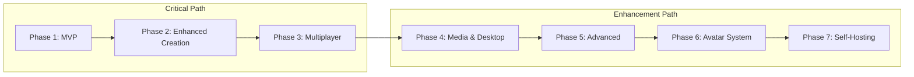

# AI RPG Platform - Implementation Plan

> **For Implementation:** Use TDD methodology - write failing tests first, then implement.

## Overview

This document outlines the step-by-step implementation plan for building the AI RPG Platform (Story AI Studio). The plan is organized into phases with clear deliverables and dependencies.

**Key Features:**
- Self-hosted Docker containers per user
- Player Avatar System with stats, superpowers, and AI companion
- MCP (Model Context Protocol) integration for AI assistant
- FoundryVTT content import
- **Fantasy UI Design System** - Medieval/fantasy themed interface

---

## Phase 1: Foundation & MVP

### 1.1 Project Setup & Infrastructure

#### Backend Setup (FastAPI)
- [ ] Initialize FastAPI project structure
- [ ] Configure PostgreSQL database with Alembic migrations
- [ ] Set up Redis for caching and session management
- [ ] Configure environment variables and secrets management
- [ ] Set up Docker containers for local development
- [ ] Configure logging and monitoring (basic)

#### Frontend Setup (Next.js)
- [ ] Initialize Next.js 14+ project with App Router
- [ ] Configure TypeScript with strict mode
- [ ] Set up Tailwind CSS for styling
- [ ] Configure ESLint and Prettier
- [ ] Set up component library foundation (shadcn/ui or similar)
- [ ] Configure environment variables

#### Fantasy UI Design System Setup
- [ ] Install fantasy fonts (Cinzel, Cinzel Decorative, Crimson Text, Cormorant Garamond, Fira Code)
- [ ] Create CSS custom properties for fantasy color palette
- [ ] Create parchment and leather texture assets
- [ ] Build base fantasy button component
- [ ] Build base fantasy card component (parchment style)
- [ ] Build base fantasy input component
- [ ] Build base fantasy modal component
- [ ] Create ornate border/frame component
- [ ] Build fantasy page layout component
- [ ] Create loading shimmer animation
- [ ] Build fantasy tooltip component

#### Monorepo Setup
- [ ] Configure monorepo structure (Turborepo or Nx)
- [ ] Set up shared packages (types, constants, utils)
- [ ] Configure build pipeline
- [ ] Set up development scripts

### 1.2 Authentication System

#### Backend Auth
- [ ] Implement JWT-based authentication
- [ ] Create user registration endpoint
- [ ] Create login endpoint with token generation
- [ ] Implement token refresh mechanism
- [ ] Add password hashing (bcrypt)
- [ ] Create user model and migrations

#### Frontend Auth (Fantasy Styled)
- [ ] Create fantasy-styled login page UI
- [ ] Create fantasy-styled registration page UI
- [ ] Implement auth context/state management
- [ ] Create protected route middleware
- [ ] Implement token storage and refresh
- [ ] Add logout functionality

### 1.3 Core Database Models

#### Models to Implement
- [ ] User model (id, email, username, preferences, created_at)
- [ ] Story model (id, creator_id, title, description, world_config, ai_settings, is_public)
- [ ] Character model (id, story_id, name, backstory, personality, attributes, image_url)
- [ ] Location model (id, story_id, name, description, connections, image_url)
- [ ] Session model (id, story_id, host_id, status, current_state)
- [ ] SessionPlayer model (id, session_id, user_id, player_state)
- [ ] StoryEvent model (id, session_id, content, event_type, metadata)

### 1.4 Story Engine (MVP)

#### AI Integration
- [ ] Create AI provider abstraction layer
- [ ] Implement OpenAI provider (GPT-4/GPT-4o)
- [ ] Create prompt templates for story generation
- [ ] Implement response parser for structured output
- [ ] Add context window management
- [ ] Create story state manager

#### Story Management
- [ ] Create story CRUD endpoints
- [ ] Implement story listing with pagination
- [ ] Create story detail endpoint
- [ ] Add story publishing workflow
- [ ] Implement basic search functionality

### 1.5 Basic World Builder

#### Creator Studio Foundation (Fantasy Styled)
- [ ] Create world editor UI (basic, fantasy themed)
- [ ] Implement character creator (basic, fantasy styled)
- [ ] Add location editor (fantasy styled)
- [ ] Create story settings panel (fantasy styled)
- [ ] Implement save/load functionality

### 1.6 Single-Player Gameplay (MVP)

#### Game Session
- [ ] Create session creation endpoint
- [ ] Implement session state management
- [ ] Create player action endpoint
- [ ] Implement AI response streaming
- [ ] Add story history retrieval
- [ ] Create session persistence

#### Game UI
- [ ] Create game session page
- [ ] Implement story display area
- [ ] Create player input interface
- [ ] Add choice selection UI
- [ ] Implement basic inventory display
- [ ] Add character stats panel

### 1.7 FoundryVTT Content Import (Phase 1 Feature)

#### Import Pipeline
- [ ] Parse FoundryVTT actor JSON files
- [ ] Parse FoundryVTT scene JSON files
- [ ] Parse FoundryVTT journal JSON files
- [ ] Create import mapping to our models
- [ ] Build import UI in creator studio
- [ ] Handle image asset extraction

#### D&D SRD Content
- [ ] Import D&D SRD 5.1/5.2 monsters
- [ ] Import D&D SRD spells
- [ ] Import D&D SRD items
- [ ] Create searchable content database
- [ ] Add content browser in creator studio

---

## Phase 2: Enhanced Creation Tools

### 2.1 Advanced World Builder

- [ ] Implement visual map editor
- [ ] Add location connection system
- [ ] Create region/area hierarchy
- [ ] Add weather/time systems
- [ ] Implement world templates

### 2.2 Character Personality System

- [ ] Create personality trait system
- [ ] Implement dialogue style configuration
- [ ] Add relationship preferences
- [ ] Create behavior patterns
- [ ] Implement character voice settings

### 2.3 Quest Designer

- [ ] Create quest creation UI
- [ ] Implement branching path editor
- [ ] Add condition system for triggers
- [ ] Create reward configuration
- [ ] Implement quest templates

### 2.4 Image Generation Integration

- [ ] Integrate DALL-E 3 for portraits
- [ ] Add scene image generation
- [ ] Create item image generation
- [ ] Implement style consistency settings
- [ ] Add image caching and storage

### 2.5 FoundryVTT World Import (Full)

- [ ] Parse complete world data
- [ ] Import roll tables
- [ ] Import playlists/audio
- [ ] Import macros
- [ ] Handle compendium packs

### 2.6 Multi-System Support

- [ ] Add Pathfinder 2e support
- [ ] Add Call of Cthulhu support
- [ ] Create system abstraction layer
- [ ] Implement system-specific rules

---

## Phase 3: Multiplayer

### 3.1 Real-time Infrastructure

- [ ] Implement WebSocket server in FastAPI
- [ ] Set up Redis Pub/Sub for scaling
- [ ] Create connection management
- [ ] Add presence tracking
- [ ] Implement heartbeat system

### 3.2 Multiplayer Sessions

- [ ] Create session host controls
- [ ] Implement player invitation system
- [ ] Add join/leave functionality
- [ ] Create turn queue system
- [ ] Implement synchronized state

### 3.3 Player Interaction

- [ ] Add in-session chat
- [ ] Create player indicators
- [ ] Implement shared story view
- [ ] Add private notes system
- [ ] Create dice roll system

### 3.4 FoundryVTT Module

- [ ] Create FoundryVTT module structure
- [ ] Implement API connection
- [ ] Add AI Game Master integration
- [ ] Create chat command handlers
- [ ] Implement dice integration

---

## Phase 4: Media & Desktop App

### 4.1 Audio Generation

- [ ] Integrate ElevenLabs for TTS
- [ ] Add OpenAI TTS as fallback
- [ ] Create voice profile system
- [ ] Implement dialogue narration
- [ ] Add ambient sound generation

### 4.2 Background Audio

- [ ] Create music track system
- [ ] Add ambient soundscapes
- [ ] Implement dynamic audio mixing
- [ ] Create audio triggers
- [ ] Add volume control per type

### 4.3 Windows Desktop App (Tauri)

- [ ] Initialize Tauri project
- [ ] Configure Rust backend
- [ ] Implement native window controls
- [ ] Add system tray support
- [ ] Create auto-updater
- [ ] Implement offline mode (basic)

### 4.4 Multi-Provider AI Support

- [ ] Add Anthropic Claude provider
- [ ] Implement local LLM support (Ollama)
- [ ] Create provider routing logic
- [ ] Add cost optimization routing
- [ ] Implement failover system

### 4.5 Community Features

- [ ] Create story sharing system
- [ ] Add ratings and reviews
- [ ] Implement favorites/bookmarks
- [ ] Create creator profiles
- [ ] Add social sharing

---

## Phase 5: Advanced Features

### 5.1 Time Travel Engine

- [ ] Implement story branch storage
- [ ] Create timeline visualization
- [ ] Add rewind functionality
- [ ] Implement branch switching
- [ ] Create parallel timeline support

### 5.2 World/Campaign Forking

- [ ] Create world clone system
- [ ] Implement modification tracking
- [ ] Add attribution system
- [ ] Create fork discovery
- [ ] Implement merge suggestions

### 5.3 Image Creation Studio

- [ ] Create AI image editor
- [ ] Add style transfer
- [ ] Implement character portrait studio
- [ ] Create scene builder
- [ ] Add asset library

### 5.4 Lore Management System

- [ ] Create wiki-style editor
- [ ] Add cross-referencing
- [ ] Implement search and filter
- [ ] Create lore templates
- [ ] Add AI-assisted lore generation

### 5.5 Map Builder

- [ ] Implement procedural generation
- [ ] Add hand-crafted tools
- [ ] Create layer system
- [ ] Add POI markers
- [ ] Implement fog of war

### 5.6 Mobile Apps (Future)

- [ ] Evaluate Tauri Mobile vs native
- [ ] Create mobile UI adaptations
- [ ] Implement touch controls
- [ ] Add offline sync
- [ ] Create mobile-specific features

---

## Phase 6: Player Avatar System

### 6.1 Avatar Creation

- [ ] Create avatar creation UI
- [ ] Implement backstory generator
- [ ] Add portrait generation
- [ ] Create attribute assignment
- [ ] Implement personality quiz

### 6.2 Stats & Progression

- [ ] Implement attribute system (STR, DEX, INT, WIS, CHA, CON)
- [ ] Create skill trees
- [ ] Add XP and leveling
- [ ] Implement stat modifiers
- [ ] Create progression rewards

### 6.3 Superpowers System

- [ ] Create power categories (Physical, Mental, Elemental, Reality, Cosmic)
- [ ] Implement power unlocking
- [ ] Add power combinations
- [ ] Create power effects
- [ ] Implement power costs/limits

### 6.4 AI Companion

- [ ] Create companion creation
- [ ] Implement personality system
- [ ] Add companion dialogue
- [ ] Create advisory system
- [ ] Implement companion UI

### 6.5 MCP Integration

- [ ] Implement MCP server for companion
- [ ] Add memory tools (search past events)
- [ ] Create lore lookup tools
- [ ] Implement relationship tracking
- [ ] Add quest analysis tools
- [ ] Create story predictor tool

### 6.6 Legacy System

- [ ] Create cross-world reputation
- [ ] Implement heirloom system
- [ ] Add follower recruitment
- [ ] Create legend points
- [ ] Implement legacy UI

---

## Phase 7: Self-Hosting Infrastructure

### 7.1 Container Architecture

- [ ] Create base Docker image for user containers
- [ ] Implement container orchestration service
- [ ] Set up container registry
- [ ] Create container lifecycle management
- [ ] Implement resource limits per tier

### 7.2 Container Orchestration

- [ ] Implement container creation on user signup
- [ ] Create container start/stop/suspend logic
- [ ] Add container health monitoring
- [ ] Implement auto-scaling for active containers
- [ ] Create container backup system

### 7.3 Invite System

- [ ] Create invite code generation
- [ ] Implement invite permission system
- [ ] Add invite acceptance flow
- [ ] Create guest user management
- [ ] Implement invite analytics

### 7.4 BYO Server Support

- [ ] Create self-hosted Docker image
- [ ] Implement license validation
- [ ] Add platform connection for sync
- [ ] Create installation documentation
- [ ] Implement update mechanism

### 7.5 Container Database Models

- [ ] UserContainer model (id, user_id, status, resources, config)
- [ ] ContainerResources model (cpu, memory, storage)
- [ ] ContainerInvite model (id, container_id, permissions, expires_at)
- [ ] InvitePermission model (can_create_stories, can_play, can_invite)

---

## Technical Debt & Maintenance

### Ongoing Tasks
- [ ] Write unit tests for core modules (TDD - tests first!)
- [ ] Create integration tests
- [ ] Set up CI/CD pipeline
- [ ] Implement error tracking (Sentry)
- [ ] Create performance monitoring
- [ ] Write API documentation
- [ ] Create user guides

### Security Tasks
- [ ] Implement rate limiting
- [ ] Add input validation
- [ ] Create security headers
- [ ] Implement CORS properly
- [ ] Add SQL injection prevention
- [ ] Create XSS prevention
- [ ] Implement CSRF protection

---

## Deployment Strategy

### Development Environment
- [ ] Local Docker Compose setup
- [ ] Hot reload for frontend and backend
- [ ] Local database with seed data
- [ ] Development AI provider (cheaper models)

### Staging Environment
- [ ] Cloud deployment (AWS/GCP/Azure)
- [ ] Staging database
- [ ] Production-like AI providers
- [ ] Testing and QA workflow

### Production Environment
- [ ] Multi-region deployment
- [ ] Production database with backups
- [ ] CDN for static assets
- [ ] Production AI providers
- [ ] Monitoring and alerting
- [ ] Incident response plan

---

## Success Metrics

### Phase 1 (MVP)
- Users can create accounts
- Users can create basic stories
- Users can play through AI-generated narratives
- FoundryVTT content can be imported

### Phase 2
- Creators can build rich worlds
- Image generation works reliably
- Multiple game systems supported

### Phase 3
- Multiple players can join sessions
- Real-time sync works smoothly
- FoundryVTT module functional

### Phase 4
- Desktop app available
- Audio generation working
- Community features active

### Phase 5
- Advanced features differentiating from competitors
- Time travel and forking working
- Mobile apps available

### Phase 6
- Player avatars fully integrated
- AI companions enhancing gameplay
- Legacy system creating long-term engagement

### Phase 7
- Self-hosted containers working
- Users can invite friends to private servers
- BYO server option available

---

## Risk Mitigation

| Risk | Mitigation |
|------|------------|
| AI API costs exceed budget | Implement aggressive caching, use cheaper models for drafts |
| Real-time sync issues | Thorough testing, fallback to polling |
| Content moderation needs | AI-based filtering, user reporting |
| FoundryVTT API changes | Version pinning, abstraction layer |
| Performance at scale | Load testing, horizontal scaling design |
| Container resource exhaustion | Per-container limits, auto-suspend inactive containers |

---

## Dependencies Between Phases

**Note:** Phases 4-7 can partially overlap with earlier phases once core features are stable.