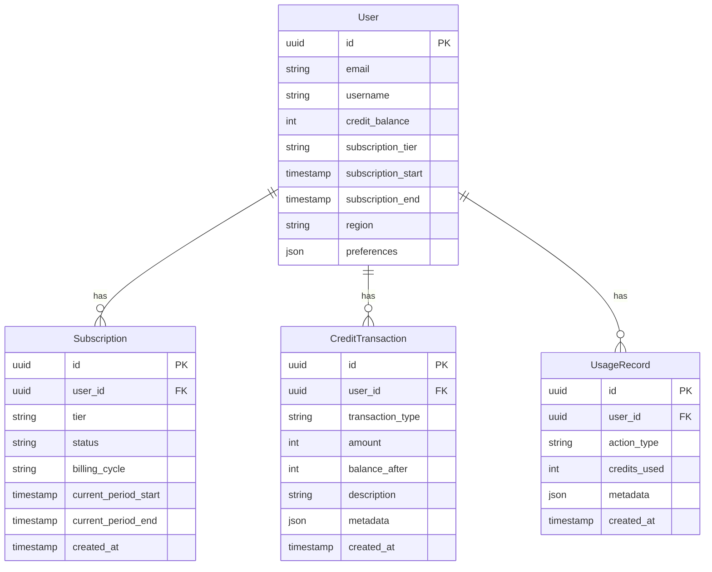

# Monetization Model: Hybrid Subscription + Credits

## Overview

A hybrid monetization model combining subscription tiers for predictable revenue with a credit system for flexibility. This approach addresses the limitations of credit-only models (mental friction, unpredictable costs) while maintaining accessibility for casual users.

---

## Why Hybrid Over Credit-Only?

### Problems with Credit-Only Model
1. **Mental Friction:** Users constantly calculate "can I afford this action?"
2. **Unpredictable Costs:** Users don't know their monthly spend
3. **Decision Paralysis:** "Should I spend credits on this?"
4. **Barrier to Flow:** Breaks immersion during gameplay

### Hybrid Solution
- **Subscriptions** provide unlimited core gameplay
- **Credits** unlock premium features and flexibility
- **Best of both worlds:** Predictable revenue + flexible usage

---

## Pricing Tiers

### Free Tier - $0/month

**Goal:** Acquisition and trial

| Feature | Limit |
|---------|-------|
| Daily Turns | 25 per day |
| Active Worlds | 3 |
| AI Model | Basic (GPT-3.5 equivalent) |
| Custom Characters | 1,000 |
| Multiplayer | Single player only |
| Mentions per Message | 1 |
| Image Generation | None |
| Text-to-Speech | None |
| World Access | Community worlds only |

**Psychology:** Generous enough to experience core gameplay, limited enough to create upgrade desire.

---

### Explorer Tier - $9.99/month

**Goal:** Convert free users, casual players

| Feature | Limit |
|---------|-------|
| Standard Turns | Unlimited |
| Active Worlds | 5 |
| AI Model | Standard (GPT-4 equivalent) |
| Custom Characters | 3,000 |
| Multiplayer | 3 players |
| Mentions per Message | 2 |
| Image Generation | None |
| Text-to-Speech | None |
| Bonus Credits | 50/month |
| World Access | All public worlds |

**Target User:** Solo players who want unlimited gameplay without premium features.

---

### Creator Tier - $19.99/month

**Goal:** Core paying users, world builders

| Feature | Limit |
|---------|-------|
| Standard Turns | Unlimited |
| Active Worlds | 10 |
| AI Model | Advanced (GPT-4 Turbo equivalent) |
| Custom Characters | 6,000 |
| Multiplayer | 5 players |
| Mentions per Message | 3 |
| Image Generation | 20/month included |
| Text-to-Speech | Standard voices |
| Bonus Credits | 100/month |
| World Access | All worlds + early access |

**Target User:** Active players and creators who need multiplayer and media generation.

---

### Master Tier - $29.99/month

**Goal:** Power users, professional creators

| Feature | Limit |
|---------|-------|
| Standard Turns | Unlimited |
| Active Worlds | Unlimited |
| AI Model | Premium (best available) |
| Custom Characters | 10,000 |
| Multiplayer | 6 players |
| Mentions per Message | 5 |
| Image Generation | 50/month included |
| Text-to-Speech | Premium + voice cloning |
| Bonus Credits | 200/month |
| World Access | Everything + exclusive worlds |
| Priority Support | Yes |
| Early Access | All new features |

**Target User:** Power users, professional world builders, and gaming groups.

---

## Credit System

### Credit Packs (One-Time Purchase)

| Pack | Credits | Price | Value |
|------|---------|-------|-------|
| Starter | 500 | $4.99 | ~$0.01/credit |
| Value | 1,500 | $12.99 | ~$0.0087/credit |
| Pro | 5,000 | $39.99 | ~$0.008/credit |
| Ultimate | 10,000 | $69.99 | ~$0.007/credit |

### Credit Usage

| Action | Credits | Approx Cost |
|--------|---------|-------------|
| Premium AI Turn (GPT-4) | 2 | ~$0.02 |
| Image Generation (Standard) | 10 | ~$0.10 |
| Image Generation (HD) | 20 | ~$0.20 |
| Voice Synthesis (Short) | 5 | ~$0.05 |
| Voice Synthesis (Long) | 15 | ~$0.15 |
| Voice Cloning (Custom) | 50 | ~$0.50 |
| World Publish (Featured) | 100 | ~$1.00 |

### When Credits Are Used

1. **Free Users:** All actions consume credits (after daily turns exhausted)
2. **Subscribers:** Only premium features consume credits
3. **Bonus Credits:** Included with subscription for premium features

---

## Revenue Projections

### User Distribution (Target)

| Tier | % of Users | ARPU | Revenue Contribution |
|------|------------|------|---------------------|
| Free | 85% | $0 | $0 |
| Explorer | 8% | $9.99 | 35% |
| Creator | 5% | $19.99 | 44% |
| Master | 2% | $29.99 | 21% |

### Example Scenarios

#### Scenario 1: 10,000 Users
- Free: 8,500 users × $0 = $0
- Explorer: 800 users × $9.99 = $7,992/month
- Creator: 500 users × $19.99 = $9,995/month
- Master: 200 users × $29.99 = $5,998/month
- **Total MRR: ~$24,000**

#### Scenario 2: 100,000 Users (Friends & Fables Scale)
- Free: 85,000 users × $0 = $0
- Explorer: 8,000 users × $9.99 = $79,920/month
- Creator: 5,000 users × $19.99 = $99,950/month
- Master: 2,000 users × $29.99 = $59,980/month
- **Total MRR: ~$240,000**

---

## Competitive Comparison

| Feature | Friends & Fables | Our Model |
|---------|------------------|------------|
| Free Tier | 25 turns/day | 25 turns/day |
| Entry Subscription | $19.95/mo | $9.99/mo |
| Mid Subscription | - | $19.99/mo |
| Premium Subscription | $29.95/mo | $29.99/mo |
| Credit System | Bonus only | Primary + Bonus |
| Pay-as-you-go | No | Yes (credits) |
| Lower Entry Point | $19.95 | $4.99 (credits) or $9.99 (sub) |

### Key Differentiators

1. **Lower Barrier:** $9.99 entry vs $19.95
2. **Flexibility:** Credits for non-subscribers
3. **More Tiers:** 3 paid tiers vs 2
4. **Credit Carryover:** Unused credits don't expire
5. **Regional Pricing:** Purchasing power parity

---

## Regional Pricing (Purchasing Power Parity)

| Region | Explorer | Creator | Master |
|--------|----------|---------|--------|
| US/EU | $9.99 | $19.99 | $29.99 |
| LATAM | $4.99 | $9.99 | $14.99 |
| MENA | $3.99 | $7.99 | $11.99 |
| South Asia | $2.99 | $5.99 | $8.99 |
| Russia/CIS | $4.99 | $9.99 | $14.99 |

---

## Anti-Abuse Measures

### Rate Limiting
- Max 60 actions per hour (any tier)
- Max 10 image generations per hour
- Max 5 voice syntheses per hour

### Fraud Prevention
- Email verification required
- No credit transfers between accounts
- Suspicious activity detection (bot patterns)
- Referral credits only after verified play

### Fair Use
- "Unlimited" subject to fair use policy
- Excessive usage flagged for review
- API access separate from gameplay

---

## Database Schema

### Transaction Types

- `subscription_bonus` - Monthly credit grant
- `purchase` - Bought credit pack
- `referral_bonus` - Referral reward
- `ai_turn` - Spent on AI response
- `image_generation` - Spent on image
- `voice_synthesis` - Spent on audio
- `refund` - Returned credits
- `expiry` - Credits expired (if applicable)

---

## Payment Integration

### Primary: Stripe
- Global payment support
- Subscription management
- Webhook integration
- Tax handling

### Regional Alternatives
- **MENA:** Local payment gateways (optional crypto)
- **South Asia:** UPI, local wallets
- **LATAM:** Mercado Pago, local cards

### Crypto (Optional)
- For regions with payment restrictions
- Stablecoins preferred (USDC, USDT)
- Non-custodial wallet connection

---

## Implementation Phases

### Phase 1: MVP (Launch)
- Free tier with daily turns
- Single subscription ($14.99 Creator tier)
- Basic credit packs
- Stripe integration

### Phase 2: Tier Expansion
- Add Explorer and Master tiers
- Regional pricing
- Enhanced features per tier

### Phase 3: Credit Economy
- Full credit system
- Referral program
- Credit gifting (with limits)

### Phase 4: Creator Economy
- World marketplace
- Revenue sharing with creators
- Premium world sales

---

## Key Metrics

### Acquisition
- Free user signups
- Free-to-paid conversion rate (target: 5-10%)

### Revenue
- Monthly Recurring Revenue (MRR)
- Average Revenue Per User (ARPU)
- Credit pack purchase rate

### Engagement
- Daily Active Users (DAU)
- Turns per session
- Feature usage by tier

### Retention
- Monthly churn rate (target: <5%)
- Subscription renewal rate
- Credit usage over time

---

## Summary

This hybrid model provides:

1. **Accessibility:** Free tier + low entry point ($9.99)
2. **Predictability:** Subscription revenue for sustainability
3. **Flexibility:** Credits for pay-as-you-go users
4. **Upsell Path:** Clear tier progression
5. **Global Reach:** Regional pricing
6. **Competitive Edge:** Lower barrier than Friends & Fables

By combining the best elements of subscription and credit models, we can maximize both user acquisition and revenue potential.
