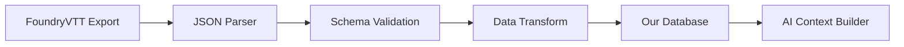

# FoundryVTT Integration Strategy

## Overview

FoundryVTT is a popular self-hosted virtual tabletop platform. Integrating with it (or leveraging its ecosystem) could significantly accelerate our development and provide access to established content.

---

## Integration Options

### Option 1: FoundryVTT Plugin/Module

Build an AI Game Master module for FoundryVTT.

**Pros:**
- Access to Foundry's 100,000+ user base
- Leverage existing VTT infrastructure
- Users already have maps, tokens, dice
- Active module ecosystem

**Cons:**
- Users must own FoundryVTT ($50 one-time)
- Limited to Foundry's architecture
- No control over core platform
- Revenue sharing complexities

**Implementation:**
```javascript
// Foundry Module Manifest
{
  "id": "ai-game-master",
  "title": "AI Game Master",
  "description": "AI-powered game master for FoundryVTT",
  "version": "1.0.0",
  "compatibility": {
    "minimum": "12.330",
    "verified": "12.331"
  },
  "scripts": ["scripts/ai-gm.js"],
  "socket": true
}
```

---

### Option 2: Content Import/Export

Support importing FoundryVTT content into our platform.

**Pros:**
- Users can migrate existing worlds
- Access to D&D 5e/5.5e content ecosystem
- No dependency on Foundry
- Full control over our platform

**Cons:**
- Complex parsing of Foundry data formats
- May need licensing for official content
- Technical debt from format conversion

**Supported Imports:**
- World data (scenes, actors, items)
- Journal entries (lore)
- Roll tables
- Macros

---

### Option 3: API Integration

Provide API endpoints that Foundry modules can call.

**Pros:**
- Lightweight integration
- Foundry users become our customers
- Recurring revenue potential
- Platform agnostic

**Cons:**
- Requires users to install module
- Network dependency
- Authentication complexity

**Architecture:**
```
FoundryVTT Client → Module → Our API → AI Response
                                    ↓
                              Credit/Subscription Check
```

---

### Option 4: Standalone Platform with Foundry Compatibility

Build our own VTT but support Foundry content formats.

**Pros:**
- Full control over UX
- Can innovate beyond Foundry
- Content portability attracts users
- No revenue sharing

**Cons:**
- More development effort
- Need to match Foundry features
- User migration friction

---

## D&D Content Licensing

### Official D&D 5e/5.5e Content

| Content Type | License | Can We Use? |
|--------------|---------|-------------|
| SRD 5.1 | OGL 1.0a | ✅ Yes, with attribution |
| SRD 5.2 (2024) | CC BY 4.0 | ✅ Yes, with attribution |
| Official Books | Copyrighted | ❌ Need license |
| Homebrew | Various | ⚠️ User responsibility |

### What We Can Include

**Under SRD 5.1/5.2 (Free to Use):**
- Core races (Human, Elf, Dwarf, Halfling, etc.)
- Core classes (Fighter, Wizard, Rogue, Cleric, etc.)
- Core spells (Fireball, Magic Missile, etc.)
- Core monsters (Goblin, Dragon, Orc, etc.)
- Basic equipment

**Requires License:**
- Campaign settings (Forgotten Realms, Eberron)
- Adventure modules (Curse of Strahd, etc.)
- Expanded subclasses/races
- Official artwork

---

## Recommended Strategy: Hybrid Approach

### Phase 1: Content Import
- Support importing FoundryVTT world data
- Parse D&D 5e SRD content (free)
- Allow users to bring their own content

### Phase 2: Foundry Module
- Build AI Game Master module for Foundry
- Subscription required for AI features
- Credit system for premium features

### Phase 3: Standalone VTT
- Build our own VTT with AI-native features
- Maintain Foundry compatibility
- Differentiate with AI-first design

---

## Technical Implementation

### FoundryVTT Data Format

Foundry stores data in JSON format:

```json
{
  "name": "Goblin",
  "type": "npc",
  "system": {
    "attributes": {
      "ac": { "value": 15 },
      "hp": { "value": 7, "max": 7 }
    },
    "abilities": {
      "str": { "value": 8 },
      "dex": { "value": 14 }
    }
  },
  "items": [
    { "name": "Scimitar", "damage": "1d6+2" }
  ]
}
```

### Import Pipeline



### AI Context from Foundry Data

```typescript
interface FoundryImport {
  actors: Actor[];      // NPCs, monsters, PCs
  scenes: Scene[];      // Maps, locations
  journal: Journal[];   // Lore, notes
  items: Item[];        // Equipment, spells
  rollTables: Table[];  // Random tables
}

function buildAIContext(import: FoundryImport): AIContext {
  return {
    worldLore: import.journal.map(j => j.content),
    npcs: import.actors.filter(a => a.type === 'npc'),
    locations: import.scenes.map(s => s.description),
    items: import.items,
    randomTables: import.rollTables
  };
}
```

---

## Monetization with Foundry Integration

### For Foundry Users (Module)

| Feature | Free | Subscriber |
|---------|------|------------|
| Basic AI responses | 10/day | Unlimited |
| Advanced AI (GPT-4) | ✗ | ✓ |
| Voice synthesis | ✗ | ✓ |
| Image generation | ✗ | Credit-based |
| Custom AI training | ✗ | Master tier |

### For Standalone Users

Full tier structure as defined in monetization-model.md

---

## Legal Considerations

### OGL 1.0a Compliance

If using SRD content, we must:
1. Include OGL license text
2. Attribute Wizards of the Coast
3. Clearly mark OGL content
4. Not claim compatibility without permission

### CC BY 4.0 Compliance (SRD 5.2)

For 2024 SRD:
1. Attribution required
2. No additional restrictions
3. Note changes if any

### FoundryVTT

- Foundry data format is not copyrighted
- User-created content belongs to users
- Cannot redistribute Foundry software

---

## Implementation Roadmap

### Sprint 1: Content Import
- [ ] Parse FoundryVTT JSON export
- [ ] Map Foundry schema to our models
- [ ] Import actors, scenes, journals
- [ ] Build AI context from imports

### Sprint 2: D&D SRD Integration
- [ ] Import SRD 5.1/5.2 content
- [ ] Build monster/spell database
- [ ] Create AI prompts with SRD data
- [ ] Attribution system

### Sprint 3: Foundry Module
- [ ] Create Foundry module scaffold
- [ ] Implement API client
- [ ] Build UI for AI interactions
- [ ] Subscription integration

### Sprint 4: Standalone VTT
- [ ] Map rendering engine
- [ ] Token management
- [ ] Dice rolling
- [ ] AI-native features

---

## Conclusion

Integrating with FoundryVTT provides a strategic advantage:

1. **Immediate access** to established VTT users
2. **Content ecosystem** for D&D and other systems
3. **Lower barrier** for user adoption
4. **Revenue opportunity** through module subscriptions

The recommended approach is to start with content import (Phase 1), then build a Foundry module (Phase 2), and eventually develop our standalone VTT (Phase 3) with AI-native features that differentiate us from Foundry.